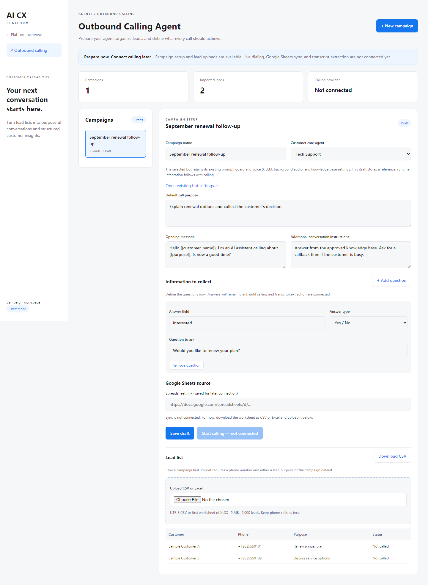
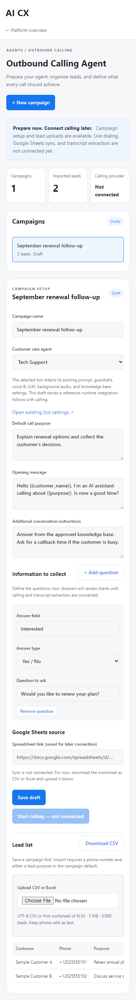

# Outbound Calling Agent

First implementation: a new launcher tile and campaign workspace at `/outbound`
on port 8004, with a link from the portal.

## Available

- Create, edit, and reopen campaign drafts in SQLite.
- Reference an existing built-in or custom customer care bot. Its prompt,
  guardrails, voice/LLM, background audio, and knowledge base remain in its existing
  administration screen. The runtime connection is deferred until calling is built.
- Configure a default purpose, opening, instructions, and typed collection questions.
- Upload UTF-8 CSV or the first worksheet of XLSX: 5 MB, 5,000 leads, 100 columns.
- Suggest phone/name/purpose mappings, requiring a choice for ambiguous matches.
- Normalize international phone formatting, reject invalid numbers or missing
  purposes, and skip duplicate numbers within a campaign. Local numbers require a
  country calling code. National trunk prefixes are not removed automatically.
  This checks number shape, not reachability. Keep Excel phone cells as text.
- Store original columns and stable generated IDs. Reimport skips existing numbers;
  it does not update their name or purpose. Shared phone numbers count as one lead.
- Download CSV with source fields, normalized details, `Not called` status, and
  blank answer columns. Formula-like cell values are escaped for spreadsheet safety.
- Audit draft saves, imports, and exports with actor and timestamp.

## RBAC

Uses existing shared `users.db` accounts. Superadmins have all outbound permissions;
ordinary users gain none automatically. Grant these in **Portal → Users**:

| Permission | Access |
| --- | --- |
| `outbound.view` | Workspace, campaign/agent listing, lead details |
| `outbound.manage` | Save drafts, preview and import leads |
| `outbound.export` | Download campaign data |

Suggested permission combinations: Viewer = view; Campaign manager = view + manage;
Analyst = view + export; Outbound administrator = all three. These are permission
combinations in the existing system, not a new stored role schema. The UI requires
view access; each mutation/export endpoint independently enforces its capability.
Revocation takes effect on the next request. Grants apply to all campaigns; there
is no per-campaign ownership isolation in this version.

Existing bot administration and launcher permissions are unchanged. Ordinary users
can access `http://localhost:8004/outbound` directly; outbound permissions do not
grant permission to change the source bot's configuration or open the launcher.

## Deferred integrations

Live dialing, provider configuration, schedules/retries, Google Sheets OAuth/sync,
transcript ingestion, and AI extraction are not connected. The Sheets URL is a saved
draft setting; for now export the worksheet and upload it. Start calling is disabled
and no dialing endpoint exists. Imports and tests never place calls. Conversation
settings and questions are stored, not executed, in this release.

Next: separate call-attempt records, a durable queue, provider callbacks, shared
customer care runtime, calling hours/opt-outs, and validated transcript extraction.
Keep call status separate from business outcome and preserve missing/uncertain answers.

## Run and test

Install root `requirements.txt`; this change adds `openpyxl==3.1.5` for Excel uploads.
Restart the launcher and portal with their existing startup scripts, or run uvicorn
from their respective `app` directories on ports 8004 and 8003.

From the repository root:

```powershell
python -m unittest discover -s launcher/tests -v
node --check launcher/static_launcher/outbound.js
# Optional UI checks with installed Microsoft Edge:
pip install -r launcher/tests/requirements.txt
python launcher/tests/browser_outbound.py
```

Tests use temporary databases and synthetic leads. The UI test covers save, import,
export, reload persistence, viewer restrictions, disabled calling, and mobile overflow.
It generates the preview images in this directory.

## Git and rollback

Implementation, tests, docs, and synthetic previews are tracked in Git on
`codex/outbound-calling-agent`. Review against `main`. Real leads/audit data live in
`outbound_campaigns.db`, ignored by Git like the existing account/provider databases.
Back up real campaign data separately using SQLite's backup API. No secrets or real
customer records should be uploaded to the source repository.

After merging, revert the feature commit (or merge commit with its appropriate
mainline) and restart launcher/portal to undo the feature. The local campaign database
is retained. Additional grants are inert without the feature; they can be removed in
user management before reverting.

## Synthetic previews




