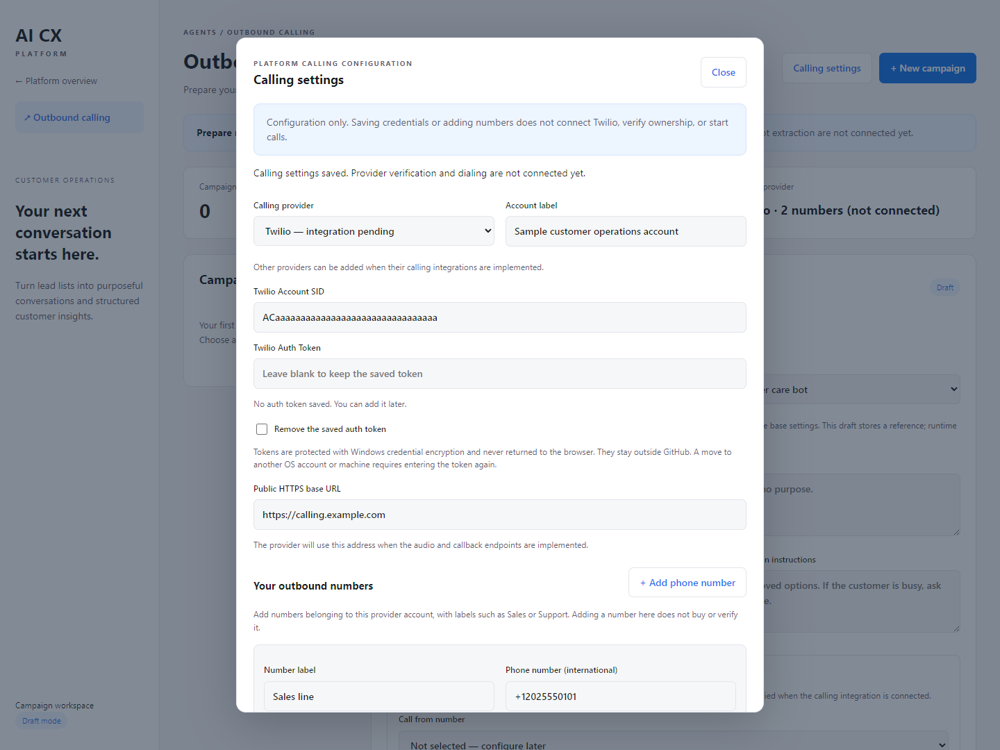
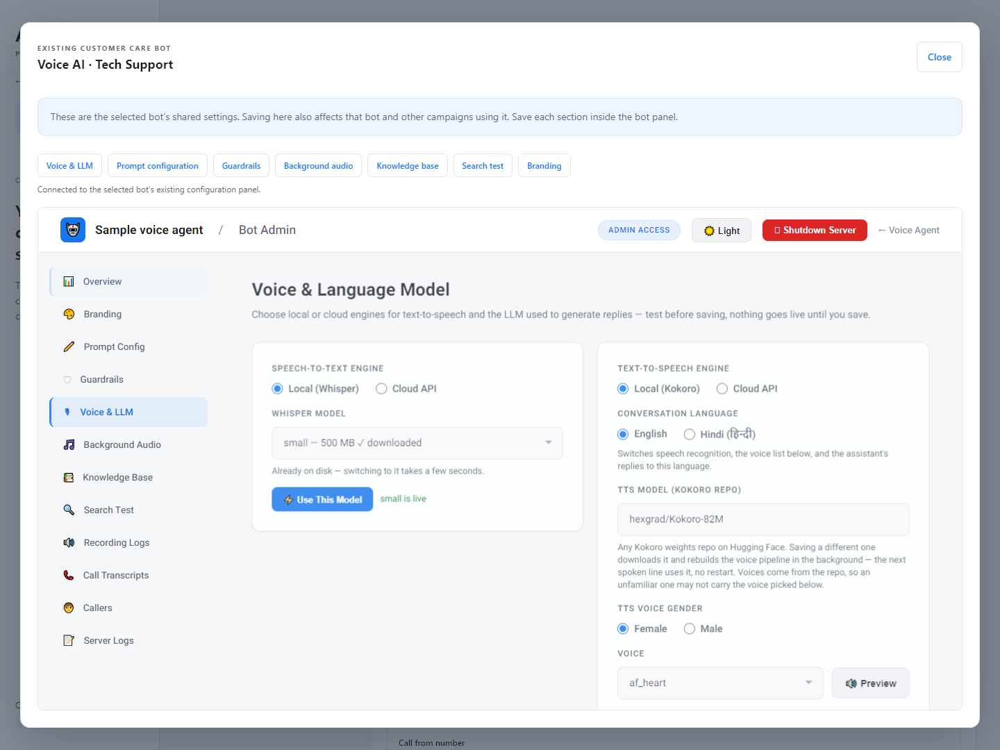

# Outbound Calling Agent

A launcher tile and campaign workspace at `/outbound`
on port 8004, with a link from the portal.

## Available

- Create, edit, and reopen campaign drafts in SQLite.
- Select an existing customer care bot and open **Configure Voice AI** inside the
  outbound workspace. This embeds the actual bot template controls for speech
  recognition, voice/language, local or cloud TTS/LLM, prompts, guardrails, background
  audio, knowledge base, search testing, and branding. The bot must be running.
  Saves affect the selected bot and every campaign using that shared configuration;
  these are not independent copies of the voice settings.
- Configure a default purpose, opening, instructions, and typed collection questions.
- Upload UTF-8 CSV or the first worksheet of XLSX: 5 MB, 5,000 leads, 100 columns.
- Suggest phone/name/purpose mappings, requiring a choice for ambiguous matches.
- Normalize international phone formatting, reject invalid numbers or missing
  purposes, and skip duplicate numbers within a campaign. Local numbers require a
  country calling code. National trunk prefixes are not removed automatically.
  This checks number shape, not reachability. Keep Excel phone cells as text.
- Store original columns and stable generated IDs. Reimport skips existing numbers;
  it does not update their name or purpose. Shared phone numbers count as one lead.
- Download CSV with source fields, normalized details, `Not called` status, and
  blank answer columns. Formula-like cell values are escaped for spreadsheet safety.
- Audit draft saves, imports, and exports with actor and timestamp.

## Calling settings and multiple phone numbers

Use **Calling settings** in the workspace header to configure a Twilio account label,
Account SID, Auth Token, and public HTTPS base URL. Other telephony providers are not
implemented. Add multiple caller numbers using international `+` format, give each
one a label (for example Sales or Support), enable/disable it, and optionally choose
a default for new campaigns. This inventory is entered manually; adding a number
neither purchases it nor verifies ownership or calling capability.

Every campaign has its own **Call from number** selector. A new campaign begins with
the configured default, but changing the default never changes existing campaigns.
A number referenced by a campaign cannot be removed or have its phone value changed
until the campaign is reassigned. Disabling a number preserves existing references,
flags it in the campaign, and prevents selecting it for new campaigns. Blank selection
is allowed while preparing drafts; no fallback or rotation occurs automatically.

Campaign calling behavior also includes:

- IANA timezone, calling days, and a same-day start/end window.
- Concurrent calls (1–20), ring timeout, maximum duration, and attempt limit.
- Retry delay and busy/no-answer retry preferences.
- Hang up on voicemail or leave a configured message.
- Recording, customer interruptions, AI/recording disclosure, opt-out phrase, and
  optional human transfer number.

These options are saved configuration for the future calling engine; they do not
currently execute. Provider testing and Start calling remain disabled.

Auth Tokens are encrypted using Windows DPAPI, bound to the current OS account and
machine. API responses expose only whether a token is set. Blank input keeps it;
replacement and explicit removal are supported. Changing the Account SID requires
replacing/removing an existing token. The protected value is in the ignored local
campaign database, never in Git or audit messages. After migrating the host or OS
account, re-enter the token. Saving a new token on a non-Windows host is currently
unsupported and fails explicitly; other draft settings do not need a token.

Provider updates use revision checking to prevent overwriting another admin's changes.

## RBAC

Uses existing shared `users.db` accounts. Superadmins have all outbound permissions;
ordinary users gain none automatically. Grant these in **Portal → Users**:

| Permission | Access |
| --- | --- |
| `outbound.view` | Workspace, campaign/agent listing, lead details |
| `outbound.manage` | Save drafts, preview and import leads |
| `outbound.export` | Download campaign data |
| `outbound.configure` | Read/change provider details, credentials, and caller-number inventory |
| `outbound.voice` | Open the embedded bot settings; selected-bot app access is also required |

Suggested permission combinations: Viewer = view; Campaign manager = view + manage;
Analyst = view + export; Calling administrator = view + configure; Voice editor =
view + voice + the selected bot permission; Full outbound administrator = all five
permissions plus access to the selected bots. These are permission
combinations in the existing system, not a new stored role schema. The UI requires
view access; each mutation/export endpoint independently enforces its capability.
Revocation takes effect on the next request. Grants apply to all campaigns; there
is no per-campaign ownership isolation in this version.

Ordinary users can access `http://localhost:8004/outbound` directly. The scoped
`/outbound/voice/{bot}/…` proxy checks both `outbound.voice` and the existing bot
permission and forwards the user's authentication to that bot. Superadmins have
full access. The original launcher `/proxy/…` route remains superadmin-only. The
embedded panel retains the source bot's own authorization checks on every request.

## Deferred integrations

Live dialing, provider connection/number verification, execution of schedules/retries, Google Sheets OAuth/sync,
transcript ingestion, and AI extraction are not connected. The Sheets URL is a saved
draft setting; for now export the worksheet and upload it. Start calling is disabled
and no dialing endpoint exists. Imports and tests never place calls. Campaign
calling options and collection questions are stored, not executed, in this release.
Voice AI changes are different: they save through the existing bot APIs and take
effect according to that bot’s normal behavior.

Next: separate call-attempt records, a durable queue, provider callbacks, shared
customer care runtime, calling hours/opt-outs, and validated transcript extraction.
Keep call status separate from business outcome and preserve missing/uncertain answers.

## Run and test

Install root `requirements.txt`; this change adds `openpyxl==3.1.5` for Excel uploads.
Restart the launcher and portal with their existing startup scripts, or run uvicorn
from their respective `app` directories on ports 8004 and 8003.

From the repository root:

```powershell
python -m unittest discover -s launcher/tests -v
node --check launcher/static_launcher/outbound.js
node --check launcher/static_launcher/outbound-config.js
# Optional UI checks with installed Microsoft Edge:
pip install -r launcher/tests/requirements.txt
python launcher/tests/browser_outbound.py
```

Tests use temporary databases and synthetic leads. The UI test covers save, import,
export, reload persistence, viewer restrictions, disabled calling, and mobile overflow.
It also tests provider setup, two caller numbers, default/selection persistence,
and all embedded Voice AI sections using the actual template and synthetic API
responses (without loading GPU models). Proxy tests separately check real forwarding
code, request authentication, permission denials, and offline behavior. The browser
test generates the synthetic preview images in this directory.

## Git and rollback

Implementation, tests, docs, and synthetic previews are tracked in Git on
`codex/outbound-calling-agent`. Review against `main`. Real leads/audit data live in
`outbound_campaigns.db`, ignored by Git like the existing account/provider databases.
Back up real campaign data separately using SQLite's backup API. No secrets or real
customer records should be uploaded to the source repository.

After merging, revert the feature commit (or merge commit with its appropriate
mainline) and restart launcher/portal to undo the feature. The local campaign database
is retained. Additional grants are inert without the feature; they can be removed in
user management before reverting.

## Synthetic previews





